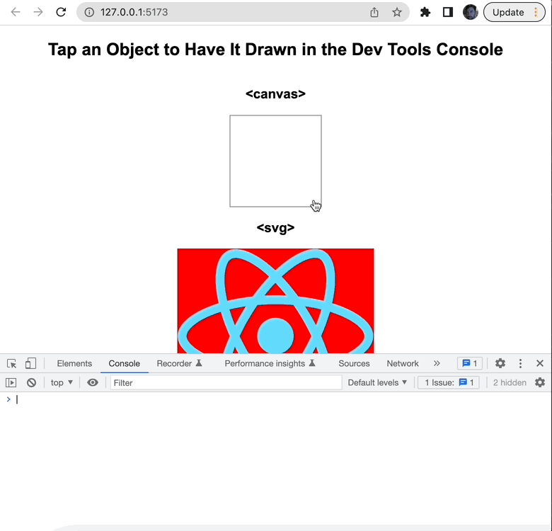

# Overview

Log visual elements to the Dev Tools console.

## Screenshots



# Installation

```
npm install console.draw
```

# Usage

```js
import { logSVG, logCanvas } from "console.draw";

logSVG(svgElement);
logCanvas(canvasElement);
```

## Contributing

#### Setup

```
git clone git@github.com:seflless/console.draw.git
cd console.draw
```

#### Watching

```
yarn dev
# Open the workbench page at http://localhost:5173/
```

#### Building

```
yarn build
```

#### Testing

**TBD**

#### Publishing to NPM

Do the usual npm version bump then publish.

```
npm version <major|minor|patch>
git push; git push --tags
npm publish
```

#### Test

Using vitest, the test are rerun whenever you change related code.

```
yarn test
```

#### Watch Tests

TODO: Do we need to put in a difference command for the CLI?
